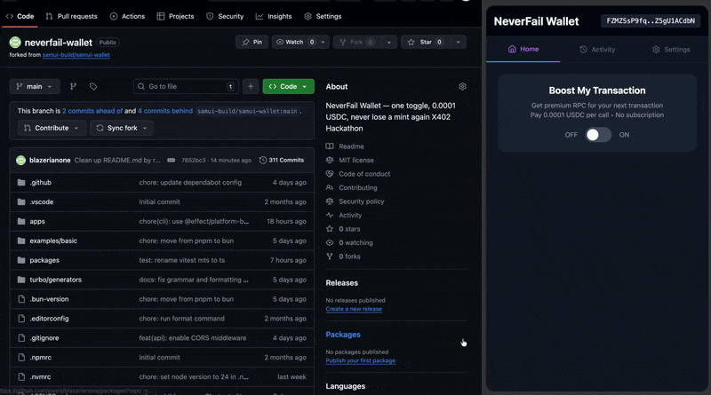

# NeverFail Wallet — Solana × x402 Pay-per-RPC

A Solana wallet extension that adds **x402 Pay-per-RPC**:  
when the network is congested or public RPCs are unreliable, users can **buy one-off premium RPC access** (USDC on devnet) directly inside the wallet — no subscriptions or monthly plans.

<p align="center">
  
</p>

> **Base:** Forked from [samui-build/samui-wallet](https://github.com/samui-build/samui-wallet)  
> We modified only the **extension** (`apps/extension/src/entrypoints/sidepanel/*`)  
> and added `apps/extension/src/lib/solana.ts` for x402 integration.

---


## ⚙️ How It Works (Technical)

### 1. Wallet UI (`app.tsx`)
```tsx
<button onClick={togglePremium}>
  {isPremium ? 'Premium Active' : 'Boost My Transaction'}
</button>
<p>Current RPC: {currentRPC}</p>
```
This button toggles between public and premium RPCs.  
When **Premium Mode** is enabled, transactions route through the x402 facilitator.

---

### 2. X402 Auto-Pay (`solana.ts`)
```ts
// 402 → build USDC tx → sign → retry with X-Payment
const payResponse = await fetch(FACILITATOR_URL, {
  headers: { 'X-Payment': base64(JSON.stringify({ serializedTransaction })) }
})
```
- On a `402 Payment Required`, the wallet builds a **USDC transfer transaction**.
- It signs the transaction inside the wallet, encodes it as `X-Payment`, and retries.
- The facilitator validates and proxies the original RPC to the premium endpoint.

---

### 3. Facilitator (Express Backend)
```
→ 402 with accepts (USDC mint + payTo)
→ Verify on-chain USDC payment
→ Proxy to Helius premium RPC
→ Return RPC result + premiumRpcUrl
```

For the backend source and setup guide, see:  
👉 [NeverFail Wallet Facilitator](https://github.com/blazerianone/neverfail-wallet-facilitator)

## 🧱 Architecture

```
Wallet → Facilitator (402) → Pay USDC → Verify → Helius RPC → Result
```
- **Client:** Wallet + x402 toggle + auto-pay logic  
- **Server:** Express + x402-express + Helius proxy  
- **Payment:** On-chain USDC (Devnet) via X402 standard  
- **RPC Switch:** Dynamic Solana Connection object updates instantly after payment


## 🧩 How to Use (Step-by-Step)

### 🧱 Requirements
Before you begin, make sure your environment meets the following requirements:

- **Node.js (LTS version 18 or higher)** — required for running scripts and backend utilities  
- **Bun (v1.3 or later)** — for installing and running workspace packages  
- **Git** — for cloning repositories  
- **Chrome or Chromium Browser** — to load the wallet extension manually in developer mode  

---

### ⚙️ Setup Instructions

We are building the open-source **Pay-Per-RPC** standard.  
Follow these steps to clone, install, and run the NeverFail Wallet with **x402 Auto-Pay**.

```bash
# 1. Clone the repo
git clone https://github.com/blazerianone/neverfail-wallet.git
cd neverfail-wallet

# 2. Install Bun (if not installed)
# macOS / Linux
curl -fsSL https://bun.sh/install | bash

# Windows (PowerShell)
powershell -c "irm bun.sh/install.ps1 | iex"

# 3. Install dependencies
bun install

# 4. Run the wallet extension
bun dev
```

Then open **chrome://extensions** → **Load unpacked** → select the output folder (e.g., `apps/extension/.output/chrome-mv3-dev`).  
Toggle **Boost My Transaction** to activate **Premium RPC Auto-Pay**.


## 🤝 Contribution

We welcome pull requests, issues, and discussions from the community.  
If you’d like to improve wallet UX, add new RPC providers, or extend x402 support:

1. Fork the repo  
2. Create a new branch  
   ```bash
   git checkout -b feature/your-feature-name
   ```
3. Commit your changes and push  
   ```bash
   git commit -m "feat: add your feature"
   git push origin feature/your-feature-name
   ```
4. Open a Pull Request on GitHub 🚀

---

## 🪪 License
[MIT](./LICENSE) © 2025 blazerianone

---

## 🔗 Links

- **Website**: https://neverfailwallet.com/
- **Facilitator (Devnet)**: https://x402.neverfailwallet.com/rpc
- **Facilitator Source**: https://github.com/blazerianone/neverfail-wallet-facilitator

---

<p align="center">
  <sub>💜 Built with x402 — Pay-Per-RPC for Everyone.</sub>
</p>
