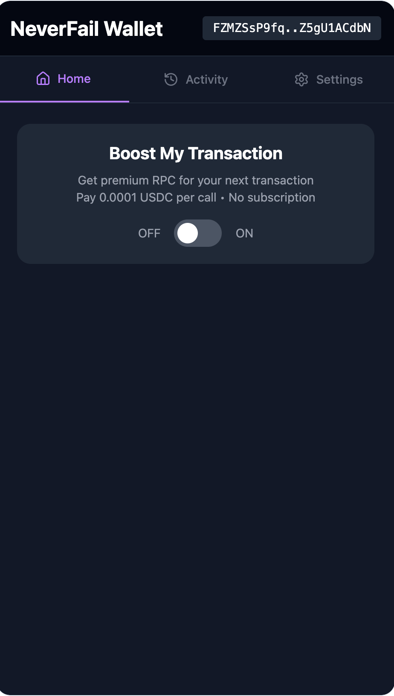

# NeverFail Wallet — Solana × x402 Pay-per-RPC

A Solana wallet extension that adds **x402 Pay-per-RPC**:  
when the network is congested or public RPCs are unreliable, users can **buy one-off premium RPC access** (USDC on devnet) directly inside the wallet — no subscriptions or monthly plans.

> **Facilitator (devnet):** `https://x402-neverfail.blockforge.live/rpc`  
> **Base:** Forked from [samui-build/samui-wallet](https://github.com/samui-build/samui-wallet)  
> We modified only the **extension** (`apps/extension/src/entrypoints/sidepanel/*`)  
> and added `apps/extension/src/lib/solana.ts` for x402 integration.

<p align="center">
  
</p>

---

## 🚀 Why NeverFail

- During **network congestion**, public RPCs often fail or time out.  
- Retail users rarely maintain a **monthly private RPC plan**.  
- **NeverFail Wallet** introduces **x402 Pay-per-RPC** —  
  pay once in **USDC (devnet)**, unlock premium RPC for your next transaction,  
  then automatically revert to public RPC.

---

## 🪄 Wallet UI Overview

<p align="center">
  
</p>

### 🔹 Boost My Transaction  
- Toggle **premium RPC on demand**  
- Price: **0.0001 USDC per call · No subscription**  
- When turned **ON**, the wallet performs the full x402 flow *automatically*:
  1. Detects a **402 Payment Required** from the facilitator  
  2. Builds the **USDC payment transaction** from the `accepts` recipe  
  3. Signs it silently inside the wallet (auto-pay enabled)  
  4. Retries the RPC with an `X-Payment` header  
  5. Premium RPC activates instantly — status shown as  
     **“x402 Auto-Pay ENABLED”**

### 🔹 Activity Tab  
Displays the latest on-chain transactions with links to **Solana Explorer**.

---

## ⚙️ Features

- 🔁 **x402 Pay-per-RPC** with USDC (devnet)
- ⚙️ **Auto-pay wrapper** detects 402 → builds & signs → retries  
- 🔐 **Wallet-native signing** via Wallet Standard  
- 🧩 Based on the open-source **Samui Wallet** foundation

---

## 🧰 Requirements

- Node (LTS) + [FNM](https://github.com/Schniz/fnm) or [NVM](https://github.com/nvm-sh/nvm)  
- [Bun](https://bun.sh) (for workspace scripts)  
- Chrome / Chromium (load the extension in Developer Mode)  
- Devnet SOL + USDC funds (for testing)

---

## 🧑‍💻 Quick Start

```bash
git clone https://github.com/blazerianone/neverfail-wallet.git
cd neverfail-wallet
fnm use      # or: nvm use
bun install

# Run the extension in dev mode
bun --filter=extension dev
```

Then open **chrome://extensions → Load unpacked**  
and select the build folder (e.g. `apps/extension/.output/chrome-mv3-dev`).

---

## 🔧 Configuration

Facilitator URL (already set):

```ts
// apps/extension/src/lib/solana.ts
const FACILITATOR_URL = 'https://x402-neverfail.blockforge.live/rpc'
```

Change this if deploying your own gateway.

---

## 🧪 How to Test (devnet)

1. **Create / Unlock** a wallet and airdrop SOL  
2. **Enable Premium RPC** in the sidepanel → wallet auto-pays (0.0001 USDC)  
3. **Open the Activity tab** — confirm that recent wallet activity is fetched via **Premium RPC** (check the browser’s network panel to verify requests hitting the facilitator endpoint)  
4. **Disable Premium RPC** to return to public RPC 

> If you lack USDC (devnet), mint or airdrop some first.  
> The facilitator defines required USDC amount + receiver address in `accepts`.

---

## 🧩 Code Highlights

| File | Purpose |
|------|-----------|
| `apps/extension/src/entrypoints/sidepanel/app.tsx` | Implements **Boost My Transaction** UI and toggle logic |
| `apps/extension/src/lib/solana.ts` | Handles HTTP 402, auto-build payments, sign & retry |

---

## 🔄 x402 Flow

```
Wallet → POST /rpc
         ← 402 { accepts:[{ asset:<USDC mint>, payTo, maxAmountRequired }] }

Wallet builds USDC transfer tx  
Wallet signs → adds X-Payment (base64(JSON{ x402Version, payload:{ serializedTransaction }}))  
             → Facilitator verifies on-chain payment  
             → Proxies RPC to premium endpoint  
             ← RPC JSON (success + optional paymentSignature)
```

---

## 🏗️ Repository Structure (changes only)

```
apps/
  extension/
    src/
      entrypoints/
        sidepanel/
          app.tsx   # Premium toggle + actions
      lib/
        solana.ts   # x402 fetch wrapper + auto-pay logic
```

All other parts remain unchanged from **Samui Wallet**.

---

## 🌐 Facilitator Backend

Hosted on **https://x402-neverfail.blockforge.live/rpc**

- Emits **402 + accepts** with USDC mint / payTo / amount  
- Verifies on-chain payment from `X-Payment`  
- Proxies the original RPC to premium endpoint and returns response  

> To self-host, see the facilitator README for Ubuntu + Apache + HTTPS setup.

---

## 🏆 Hackathon Context

Built for the **[Solana x402 Hackathon](https://solana.com/x402/hackathon#resources)**  
to demonstrate a user-friendly **Pay-per-RPC** model inside a wallet.

---

## 🙏 Credits

- Base wallet: [Samui Wallet](https://github.com/samui-build/samui-wallet) — thank you to its maintainers and contributors 💜  
- NeverFail Wallet adds the x402 Premium RPC integration and UI demo.

---

## 📄 License

MIT License (includes upstream Samui Wallet license terms)

---

## 👥 Maintainer

**NeverFail Wallet** — x402 integration by [@blazerianone](https://github.com/blazerianone)  
Facilitator (devnet): `https://x402-neverfail.blockforge.live/rpc`

---

<p align="center">
  <sub>Built with 💜 for the Solana x402 Hackathon.</sub>
</p>
